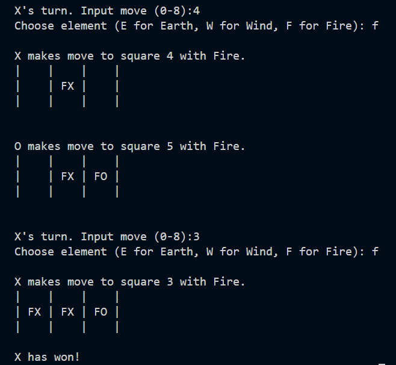

# Tic-Tac-Toe-Twist

Tic-Tac-Toe-Twist offers a collection of unique and exciting variations on the classic Tic-Tac-Toe game, all designed for the human player to challenge the computer (but can easily be modified to human/human or computer/computer). Below is a detailed explanation of each version included in this collection.

## Versions

### 1. Classic Tic-Tac-Toe
This version features the traditional 3x3 grid. Players take turns placing their marks (X or O) in empty squares. The goal is to be the first to get three marks in a row, column or diagonal.

### 2. Timed Moves
In this variation, players have only 3 seconds to make their move. If a player fails to make a move within the time limit, their turn is skipped, and the opponent gets to make a move again. This adds a sense of urgency and tests the players' quick decision-making skills.

### 3. Capture Mode
Capture Mode allows players to overwrite their opponent's mark on the board and replace it with their own. The available moves include all empty squares and the opponent's marks, excluding the player's own marks. This twist adds a strategic layer to the game as players must consider both offensive and defensive moves.

### 4. 4x4 Grid Tic-Tac-Toe
Expanding the classic game to a 4x4 grid, this version requires players to get four marks in a row, column, or diagonal to win. The larger grid size increases the complexity and strategic depth of the game.

### 5. Random Obstacles
This mode played on a 4x4 board introduces obstacles on the board, represented by asterisks (*). There are two variations of this mode:

- Every Three Moves: Obstacles appear after every three moves.
- Random Appearance: Obstacles appear randomly, with a 50% chance of occurring after each move. Obstacles block certain squares, making the game more challenging.

### 6. Elemental Tic-Tac-Toe or Earth, Wind and Fire
In Elemental Tic-Tac-Toe, each player has three of each element: Earth (E), Wind (W), and Fire (F).  In this version, each player can only use each element up to 3 times. To win a row, column or diagonal, all squares in that line must contain the same element. The player with the majority of marks in that line wins. For example, if a row contains Fire X, Fire X and Fire O, then X wins because the row is filled with Fire and X has more marks.

### 7. Ultimate Tic-Tac-Toe
This version combines multiple twists for an ultimate challenge:

- 4x4 Grid: Players play on a larger board.
- Timed Moves: Each move must be made within 3 seconds.
- Random Obstacles: Obstacles appear randomly with a 50% chance.
- Capture Mode: Players can overwrite their opponent's marks.

#

### Example of Earth, Wind and Fire Tic-Tac-Toe:
